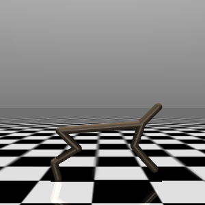
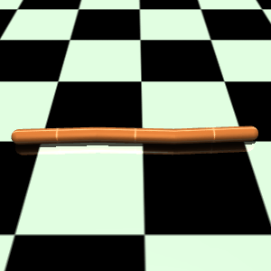

<h1 align="center">
  <a href="https://github.com/EMI-Group/evox">
  <picture>
    <source media="(prefers-color-scheme: dark)" srcset="./assets/evox_logo_dark.png">
    <source media="(prefers-color-scheme: light)" srcset="./assets/evox_logo_light.png">
      
  </picture>
  </a>
  <br>
</h1>

<p align="center">
🌟 TensorRVEA: Tensorized RVEA for GPU-accelerated Evolutionary Multi-objective Optimization 🌟
</p>

<p align="center">
  <a href="https://arxiv.org/abs/2404.01159">
    
  </a>
</p>


Tensorized Reference Vector Guided Evolutionary Algorithm (TensorRVEA) aims to enhance the scalability and efficiency of evolutionary multi-objective optimization by incorporating GPU acceleration. By adapting key data structures and operators into tensor forms, TensorRVEA seeks to utilize GPU-based parallel computing to offer a more efficient approach to complex optimization challenges.  The implementation of TensorRVEA is compatible with the [EvoX](https://github.com/EMI-Group/evox/) framewrok in JAX.


## Demonstrations
Below are demonstrations of TensorRVEA applied to various simulated multiobjective robotics environments. Specifically, TensorRVEA optimizes the parameters of the MLP, and then uses this MLP as a policy model to visualize the robot's behavior in the simulated environment.

<table width="90%">
  <tr>
    <td width="30%">
      </img>
    </td>
    <td width="30%">
      </img>
    </td>
    <td width="30%">
      </img>
    </td>
  </tr>
  <tr>
    <td align="center">
      MoHalfcheetah
    </td>
    <td align="center">
      MoHopper-m2
    </td>
    <td align="center">
      MoSwimmer
    </td>
  </tr>
</table>


- MoHalfcheetah: Optimizing for speed and control cost.
- MoHopper-m2: Aiming for maximum speed and jumping height.
- MoSwimmer: Enhancing movement efficiency in fluid environments.

## Key Features

- **GPU Acceleration** 💻: Leverages GPUs for enhanced computational capabilities.
- **Large-Scale Optimization** 📈: Ideal for large population sizes and high-dimensional challenges.
- **Flexibility** 🔨: Compatible with a variety of tensor-based reproduction operators, including GA, DE, PSO, and CSO.
- **Real-World Applications** 🌐: Suited for complex tasks like multiobjective robotic control (MoBrax), with a special emphasis on neuroevolution methodologies.

## Requirements
TensorRVEA requires:
- evox (version == 0.8.1)
- jax (version >= 0.4.16)
- jaxlib (version >= 0.3.0)
- brax (version == 0.10.3)
- flax
- Visualization tools: plotly, pandas


## Example Usage
Sample example for DTLZ problems:

```python
from evox import workflows, problems
import algorithms
from evox.monitors import PopMonitor
from evox.metrics import IGD
import jax
import jax.numpy as jnp
import numpy as np
import time


def run_moea(algorithm, key):
    monitor = PopMonitor()

    problem = problems.numerical.DTLZ2(m=3)
    workflow = workflows.StdWorkflow(
        algorithm=algorithm,
        problem=problem,
        monitor=monitor,
    )

    state = workflow.init(key)

    true_pf = problem.pf()

    igd = IGD(true_pf)

    for i in range(100):
        key, subkey = jax.random.split(key)
        state = workflow.step(state)

        fit = state.get_child_state("algorithm").fitness
        non_nan_rows = fit[~np.isnan(fit).any(axis=1)]
        print(f'Generation {i+1}, IGD: {igd(non_nan_rows)}')
    fig = monitor.plot()
    fig.show()


if __name__ == '__main__':
    lb = jnp.full(shape=(12,), fill_value=0)
    ub = jnp.full(shape=(12,), fill_value=1)

    algorithm = algorithms.TensorRVEA(
        lb=lb,
        ub=ub,
        n_objs=3,
        pop_size=100,
    )
    key = jax.random.PRNGKey(42)

    start = time.time()
    run_moea(algorithm, key)
    end = time.time()
    print(f"time: {end-start}s")
```

Sample example for MoBrax:

```python
from algorithms import TensorRVEA
from evox.workflows import StdWorkflow
from evox.monitors import StdMOMonitor
from evox.utils import TreeAndVector
import jax
import jax.numpy as jnp
from flax import linen as nn
import time
import problems
from evox.operators.sampling import UniformSampling
from evox.metrics import HV
from metrics.expected_utility import ExpectedUtility

env_name = "mo_swimmer"


class Model(nn.Module):

    @nn.compact
    def __call__(self, x):
        x = nn.Dense(16)(x)
        x = nn.tanh(x)
        x = nn.Dense(2)(x)
        x = nn.tanh(x)
        return x


def main():
    key = jax.random.PRNGKey(43)
    model_key, workflow_key = jax.random.split(key)
    model = Model()
    params = model.init(model_key, jnp.zeros((8,)))
    adapter = TreeAndVector(params)
    monitor = StdMOMonitor(record_pf=False)

    problem = problems.MoBrax(
        policy=jax.jit(model.apply),
        env_name=env_name,
        cap_episode=1000,
        num_obj=2,
    )
    center = adapter.to_vector(params)

    workflow = StdWorkflow(
        algorithm=TensorRVEA(
            lb=jnp.full_like(center, -8),
            ub=jnp.full_like(center, 8),
            n_objs=2,
            pop_size=100,
            uniform_init=False,
        ),
        problem=problem,
        monitor=monitor,
        num_objectives=2,
        pop_transform=adapter.batched_to_tree,
        opt_direction="max",
    )

    state = workflow.init(workflow_key)
    step_func = jax.jit(workflow.step).lower(state).compile()
    state = step_func(state)
    w = UniformSampling(100, 2)()[0]
    ref = jnp.array([0, -1])
    hv_metric = HV(ref=-ref)
    eu_metric = ExpectedUtility(w=w)
    start = time.time()
    for i in range(100):
        key, subkey = jax.random.split(key)
        state = step_func(state)
        f = -state.get_child_state("algorithm").fitness
        f = f[~jnp.isnan(f).any(axis=1)]
        current_f = f[jnp.all(f >= ref, axis=1)]
        if current_f.shape[0] == 0:
            hv = 0
            eu = 0
        else:
            hv = hv_metric(jax.random.split(workflow_key)[1], -current_f)
            eu = eu_metric(current_f)
        print(f'Generation {i+1}, HV: {hv}, EU: {eu}')
    end = time.time()
    print(f"Total time: {end - start}s")


if __name__ == "__main__":
    main()
```

## Community & Support

- Engage in discussions and share your experiences on [GitHub Discussion Board](https://github.com/EMI-Group/evox/discussions).
- Join our QQ group (ID: 297969717).
  
## Citing TensorRVEA

If you use TensorRVEA in your research and want to cite it in your work, please use:
```
@inproceedings{tensorrvea,
    author = {Liang, Zhenyu and Jiang, Tao and Sun, Kebin and Cheng, Ran},
    title = {GPU-accelerated Evolutionary Multiobjective Optimization Using Tensorized RVEA},
    year = {2024},
    doi = {10.1145/3638529.3654223},
    booktitle = {Proceedings of the Genetic and Evolutionary Computation Conference},
    pages = {566–575},
    numpages = {10},
    location = {Melbourne, VIC, Australia},
    series = {GECCO '24}
}
